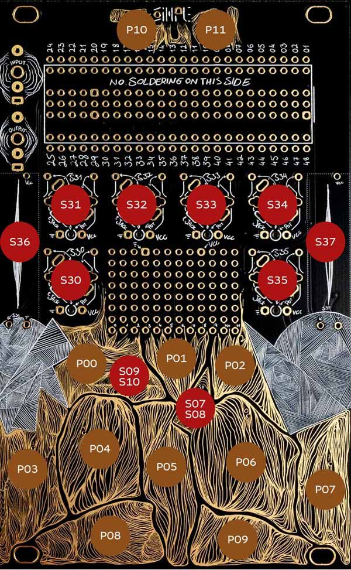
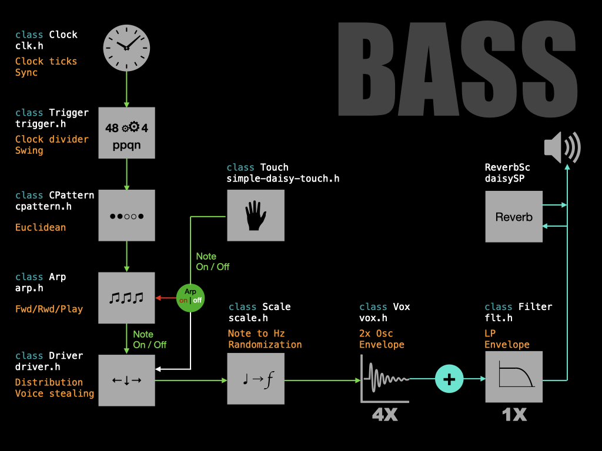

# THIS IS SIMPLE BASS

## QUICK INSTALL
Download the [Binary file](https://github.com/Synthux-Academy/simple-touch-instruments/raw/main/daisyduino/TouchBass/TouchBass.bin) and flash using the [Daisy Seed web programmer](https://electro-smith.github.io/Programmer/)

## CONTROLS

**Switches**
- S07-S08 - arpeggiator off/on/latch
- S09-S10 - Osc 2 mode: \\\ → sound, || and // → AM.     

**Knobs**
- S30 - Osc 2 amount
- S31 - Osc 1 pitch +/- 1 octave
- S31 + P10 - Osc 1 waveform saw/square
- S32 - Osc 2 pitch +/- 1 octave
- S33 - pattern
- S34 - pitch randomisation
- S35 - envelope randomisation
- S35 + P10 - reverb mix
- S36 - filter cutoff
- S36 + P10 - filter resonance
- S36 + P11 - filter envelope amount
- S37 - envelope

**Pads**
- P10 + P0/P02 - arpeggiator speed +/-
- P11 + P0/P02 - scale (one of the three)
- P03...P09 - notes
- P10 + P11 - monophonic / paraphonic mode

